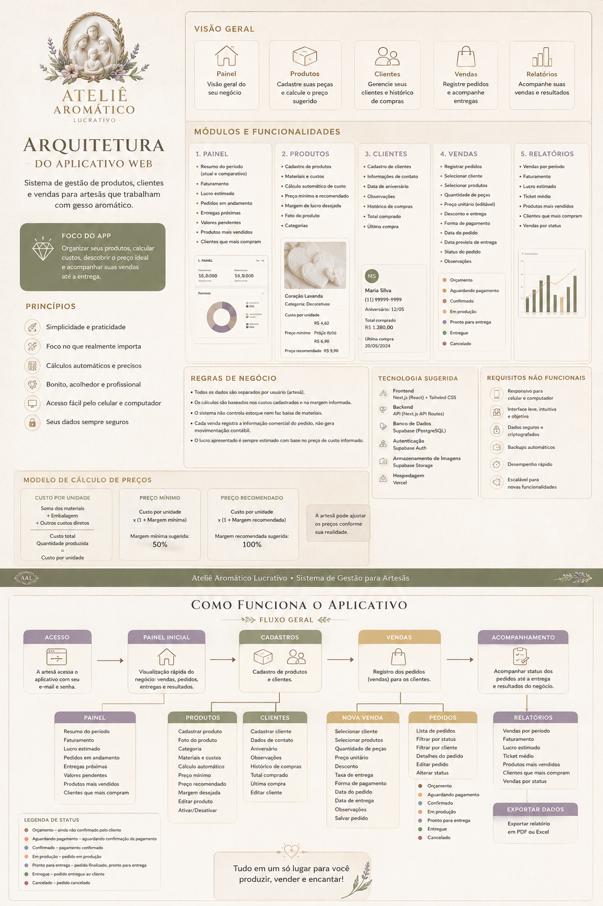

# Calculadora do Ateliê — Plano de Implementação no Codex

> **Para o Codex:** implemente este projeto em tarefas pequenas, testáveis e sequenciais. Use TDD nas regras de negócio, faça commits frequentes e não amplie o escopo sem necessidade. Antes de encerrar qualquer tarefa, rode os testes, o lint e o build relacionados à alteração.

## 1. Objetivo do produto

Construir um aplicativo web responsivo para artesãs que trabalham com gesso aromático e precisam:

- cadastrar produtos e os custos de produção;
- calcular automaticamente o custo por unidade;
- receber um **preço mínimo** e um **preço recomendado**;
- definir o preço realmente praticado;
- cadastrar e consultar clientes;
- registrar vendas com vários produtos e quantidades;
- acompanhar pedidos, pagamentos e datas de entrega;
- visualizar faturamento e lucro estimado;
- consultar o histórico de compras de cada cliente.

O aplicativo não será um sistema contábil, fiscal ou de estoque. Todos os valores apresentados como lucro são **estimativas comerciais baseadas nos custos informados pela própria usuária**.

## 2. Proposta de valor

> Cadastre sua peça uma vez, descubra quanto ela custa, veja um preço mínimo e um preço recomendado e use o mesmo produto para registrar todos os seus pedidos.

## 3. Público

Mulheres iniciantes no artesanato que produzem em casa e querem transformar criatividade em renda. A interface deve ser:

- simples;
- acolhedora;
- mobile-first;
- fácil de entender sem treinamento;
- visualmente premium, mas sem aparência de sistema contábil;
- escrita integralmente em português do Brasil.

## 4. Modelo comercial do piloto

- Pagamento único.
- Acesso vitalício à versão adquirida.
- A venda será feita fora do aplicativo, pelo WhatsApp.
- Não implementar gateway de pagamento no piloto.
- A cliente cria uma conta com e-mail e senha.
- Contas novas começam com status `pending`.
- A proprietária libera manualmente a conta alterando o status para `active` no painel do Supabase.
- Contas `pending` visualizam uma página de “Aguardando liberação”.
- Contas `suspended` não acessam os dados do aplicativo.
- Não criar painel administrativo no primeiro piloto.

## 5. Referência visual

Use como referência de arquitetura e direção visual:

```text
./arquitetura-calculadora-do-atelie.png
```



A imagem é uma referência visual e de fluxo. A interface real deve usar textos nativos, componentes acessíveis e layouts responsivos; não transforme a imagem em uma tela estática.

---

# 6. Stack técnica

## Aplicação

- Next.js com App Router.
- TypeScript em modo estrito.
- React Server Components por padrão.
- Client Components somente quando houver interação no navegador.
- Tailwind CSS.
- Supabase para banco de dados e autenticação.
- React Hook Form para formulários.
- Zod para validação compartilhada.
- Vitest para regras de negócio e testes de componentes.
- React Testing Library para componentes.
- Playwright para testes de ponta a ponta.
- Lucide React para ícones lineares.
- Vercel para hospedagem do frontend.
- Supabase para PostgreSQL e autenticação.

## Convenções

- Use `npm` e mantenha `package-lock.json` versionado.
- Use a versão estável mais recente compatível das dependências no momento da criação.
- Nunca exponha chave secreta ou `service_role` no navegador.
- No cliente, use somente a URL pública e a publishable key do Supabase.
- Use valores monetários inteiros em centavos no banco.
- Armazene timestamps em UTC.
- Use campos `date` para datas de pedido e entrega que não dependem de horário.
- Formate moeda com `pt-BR` e `BRL`.
- Considere `America/Sao_Paulo` nas exibições de período.
- Não confie em `user_id` enviado pelo navegador.
- Obtenha o usuário autenticado no servidor antes de qualquer mutação.
- Todas as tabelas públicas devem ter Row Level Security habilitado.

---

# 7. Identidade visual

## Conceito

Artesanato sensorial premium, acolhedor, delicado, elegante e lucrativo. A estética deve transmitir cuidado manual, aroma, bem-estar, feminilidade madura e profissionalismo.

## Paleta

```css
:root {
  --color-ivory: #F4F0E8;
  --color-paper: #ECE8E1;
  --color-plaster-white: #F8F6F1;
  --color-antique-gold: #9B793F;
  --color-dark-gold: #6F5A35;
  --color-sage: #7D8063;
  --color-olive: #686246;
  --color-muted-lavender: #82758A;
  --color-clay-beige: #C9BFB1;
  --color-warm-graphite: #3E3A34;
}
```

## Tipografia

- **Cinzel:** marca, selos e pequenas etiquetas.
- **Cormorant Garamond:** títulos, números e indicadores principais.
- **Montserrat:** navegação, formulários, botões e texto corrido.

Carregue as fontes com `next/font/google`.

## Diretrizes de componentes

- Fundo principal marfim.
- Superfícies em branco-gesso.
- Bordas finas em bege-argila.
- Sombras muito suaves.
- Cantos arredondados, sem exagero.
- Ícones lineares consistentes.
- Botão principal em verde-oliva.
- Botão secundário em fundo claro com borda dourada.
- Estados destrutivos discretos, mas claramente identificáveis.
- Muito espaço de respiro.
- Evitar grids de cartões excessivos.
- No desktop, usar sidebar.
- No celular, usar barra inferior fixa.
- Formulários divididos em etapas quando forem longos.
- Nunca sacrificar legibilidade por decoração.
- Respeitar `prefers-reduced-motion`.

## Tokens iniciais

```ts
export const designTokens = {
  colors: {
    background: "#F4F0E8",
    surface: "#F8F6F1",
    surfaceMuted: "#ECE8E1",
    primary: "#686246",
    primaryHover: "#59543C",
    secondary: "#9B793F",
    secondaryDark: "#6F5A35",
    lavender: "#82758A",
    border: "#C9BFB1",
    text: "#3E3A34",
    textMuted: "#6F675E",
    success: "#66765A",
    warning: "#A57945",
    danger: "#9A5E59",
  },
  radius: {
    sm: "8px",
    md: "12px",
    lg: "18px",
  },
};
```

---

# 8. Escopo funcional do MVP

## Incluído

1. Cadastro, login, logout e recuperação de senha.
2. Liberação manual de acesso.
3. Perfil do ateliê.
4. Configurações dos multiplicadores de preço.
5. Cadastro, edição, visualização e arquivamento de produtos.
6. Cadastro dos itens de custo de cada produto.
7. Cálculo do custo total do lote e custo por unidade.
8. Cálculo de preço mínimo e recomendado.
9. Cadastro, edição e visualização de clientes.
10. Registro de venda com vários produtos.
11. Alteração do preço unitário em uma venda específica.
12. Desconto e taxa de entrega.
13. Data do pedido e data prevista de entrega.
14. Status de pedido.
15. Status de pagamento.
16. Histórico comercial do cliente.
17. Painel com indicadores básicos.
18. Busca e filtros nas listas.
19. Layout mobile-first.
20. Testes unitários e ponta a ponta dos fluxos essenciais.

## Fora do MVP

- Estoque de matérias-primas.
- Baixa automática de insumos.
- Cadastro global de estoque.
- Emissão de nota fiscal.
- Conciliação bancária.
- Integração com conta bancária.
- Integração oficial com WhatsApp.
- Loja virtual.
- Gateway de pagamento.
- Gestão de equipe.
- Aplicativo nativo para Android ou iOS.
- Relatórios contábeis.
- Exportação em PDF ou Excel.
- Cupons.
- Assinatura recorrente.
- Painel administrativo próprio.
- Upload de fotos no primeiro marco funcional.
- Notificações push.
- Mensagens automáticas para clientes.

---

# 9. Regras de negócio

## 9.1 Precificação

Cada produto representa uma receita ou lote de produção.

### Dados do lote

- Quantidade produzida no lote.
- Itens de custo.
- Custo de embalagem por unidade.
- Outros custos diretos do lote.
- Multiplicador mínimo.
- Multiplicador recomendado.
- Preço praticado pela usuária.

### Item de custo

Cada item deve permitir:

- nome;
- quantidade comprada;
- preço pago pela quantidade comprada;
- quantidade utilizada no lote;
- unidade de medida.

Exemplo:

```text
Material: Gesso
Quantidade comprada: 5.000 g
Preço pago: R$ 25,00
Quantidade utilizada: 500 g
Custo utilizado no lote: R$ 2,50
```

### Fórmulas

```text
custo_do_item =
  preço_da_compra × (quantidade_utilizada ÷ quantidade_comprada)

custo_dos_materiais_do_lote =
  soma de todos os custos dos itens

custo_das_embalagens_do_lote =
  custo_da_embalagem_por_unidade × quantidade_produzida

custo_total_do_lote =
  custo_dos_materiais_do_lote
  + custo_das_embalagens_do_lote
  + outros_custos_diretos_do_lote

custo_por_unidade =
  custo_total_do_lote ÷ quantidade_produzida

preço_mínimo =
  custo_por_unidade × multiplicador_mínimo

preço_recomendado =
  custo_por_unidade × multiplicador_recomendado
```

### Padrões

```text
Multiplicador mínimo padrão: 1,50
Multiplicador recomendado padrão: 2,00
```

Esses valores podem ser alterados em Configurações.

### Arredondamento

- Todos os cálculos monetários devem produzir centavos inteiros.
- Arredonde somente no final de cada valor monetário exibido ou persistido.
- Nunca use `number` com valores em reais para cálculos internos.
- Use centavos inteiros ou uma biblioteca decimal.
- Divisão por zero deve retornar erro de validação.
- Quantidades devem ser maiores que zero.
- O multiplicador recomendado deve ser maior ou igual ao multiplicador mínimo.

### Valores derivados

Os campos derivados podem ser persistidos para facilitar consultas, mas devem ser recalculados no servidor sempre que o produto ou seus custos forem alterados:

- `material_cost_batch_cents`;
- `packaging_cost_batch_cents`;
- `total_cost_batch_cents`;
- `unit_cost_cents`;
- `minimum_price_cents`;
- `recommended_price_cents`;
- `estimated_profit_at_selling_price_cents`.

## 9.2 Produtos

- Um produto pertence a somente uma usuária.
- Um produto pode ter vários itens de custo.
- Produtos não devem ser apagados definitivamente se já estiverem relacionados a vendas.
- Use arquivamento com `is_active = false`.
- Produtos arquivados não aparecem por padrão em novas vendas.
- Produtos arquivados continuam visíveis nas vendas antigas.
- O preço praticado é definido pela usuária.
- O preço praticado pode ser diferente do mínimo e do recomendado.
- Se ficar abaixo do mínimo, mostrar alerta não bloqueante.

## 9.3 Clientes

- Um cliente pertence a somente uma usuária.
- Nome é obrigatório.
- WhatsApp é recomendado, mas não obrigatório.
- Não bloquear nomes duplicados.
- Exibir histórico de pedidos.
- Total comprado deve excluir pedidos cancelados.
- Próxima entrega deve considerar pedidos não entregues e não cancelados.
- O botão de WhatsApp deve gerar somente um link simples, sem API oficial.
- Normalizar o telefone para gerar o link, mas preservar a forma digitada para exibição.

## 9.4 Vendas

Uma venda pode conter vários itens.

### Cálculos

```text
subtotal_do_item =
  quantidade × preço_unitário

custo_estimado_do_item =
  quantidade × custo_unitário_snapshot

lucro_estimado_do_item =
  subtotal_do_item - custo_estimado_do_item

subtotal_da_venda =
  soma dos subtotais dos itens

total_da_venda =
  subtotal_da_venda - desconto + taxa_de_entrega

custo_estimado_da_venda =
  soma dos custos estimados dos itens

lucro_estimado_da_venda =
  total_da_venda - custo_estimado_da_venda
```

A taxa de entrega entra no faturamento e no lucro estimado, pois não haverá controle contábil de custo logístico no MVP. Exiba uma nota discreta explicando que o lucro é estimado.

### Snapshot obrigatório

Ao adicionar um produto a uma venda, copie para `sale_items`:

- nome do produto;
- unidade de venda;
- custo unitário;
- preço unitário;
- preço mínimo vigente;
- preço recomendado vigente.

Alterações futuras no produto não podem modificar uma venda antiga.

### Status do pedido

```text
quote                 Orçamento
awaiting_payment      Aguardando pagamento
confirmed             Confirmado
in_production         Em produção
ready                  Pronto para entrega
delivered              Entregue
canceled               Cancelado
```

### Status do pagamento

```text
unpaid                 Não pago
partially_paid         Parcialmente pago
paid                   Pago
```

### Regras

- Venda cancelada não entra em faturamento, lucro, ticket médio ou ranking.
- Orçamento não entra no faturamento.
- Para o painel, contabilize vendas com status:
  - `awaiting_payment`;
  - `confirmed`;
  - `in_production`;
  - `ready`;
  - `delivered`.
- Exiba separadamente valores ainda não pagos.
- Uma venda pode não ter cliente associado.
- Quantidade deve ser inteira e maior que zero.
- Desconto não pode ser negativo.
- Taxa de entrega não pode ser negativa.
- Total final não pode ser negativo.
- Data de entrega não pode ser anterior à data do pedido.
- Permita editar status, pagamento, entrega e observações depois do cadastro.
- Não permita editar os itens após a venda estar `delivered`, a menos que o pedido volte para outro status mediante confirmação explícita.

## 9.5 Painel

Período padrão: mês atual.

Indicadores:

- faturamento;
- lucro estimado;
- quantidade de pedidos;
- ticket médio;
- valores pendentes;
- pedidos em andamento;
- entregas nos próximos sete dias;
- produtos mais vendidos;
- clientes que mais compraram;
- vendas recentes.

Regras:

- Excluir orçamentos e cancelados dos indicadores financeiros.
- Ticket médio = faturamento ÷ quantidade de vendas consideradas.
- Pedidos em andamento = `awaiting_payment`, `confirmed`, `in_production` e `ready`.
- Valores pendentes = total das vendas não canceladas e não classificadas como `paid`.
- Como o MVP não registra parcelas recebidas, o valor pendente será o total da venda para `unpaid` e também para `partially_paid`. Mostrar claramente que é uma aproximação.
- Produtos mais vendidos devem ser ordenados pela quantidade de unidades.
- Clientes que mais compraram devem ser ordenados pelo total das vendas válidas.

---

# 10. Rotas da aplicação

```text
/
├── /entrar
├── /cadastro
├── /recuperar-senha
├── /redefinir-senha
├── /aguardando-liberacao
└── /app
    ├── /painel
    ├── /produtos
    ├── /produtos/novo
    ├── /produtos/[productId]
    ├── /produtos/[productId]/editar
    ├── /clientes
    ├── /clientes/novo
    ├── /clientes/[customerId]
    ├── /clientes/[customerId]/editar
    ├── /vendas
    ├── /vendas/nova
    ├── /vendas/[saleId]
    ├── /vendas/[saleId]/editar
    └── /configuracoes
```

## Proteção

- Rotas `/app/**` exigem sessão válida.
- Perfil `pending` redireciona para `/aguardando-liberacao`.
- Perfil `suspended` redireciona para uma tela de acesso suspenso.
- Usuário autenticado e ativo não deve acessar novamente `/entrar`.
- Server Actions devem validar sessão e status de acesso.
- RLS permanece a proteção final do banco.

---

# 11. Navegação

## Desktop

Sidebar com:

1. Painel.
2. Produtos.
3. Vendas.
4. Clientes.
5. Configurações.
6. Sair.

## Celular

Barra inferior fixa:

1. Início.
2. Produtos.
3. Nova venda.
4. Vendas.
5. Clientes.

Configurações e sair ficam no menu do cabeçalho.

O botão “Nova venda” deve ser o elemento de maior destaque da navegação móvel.

---

# 12. Modelo de banco de dados

## 12.1 Tipos

```sql
create type public.access_status as enum (
  'pending',
  'active',
  'suspended'
);

create type public.order_status as enum (
  'quote',
  'awaiting_payment',
  'confirmed',
  'in_production',
  'ready',
  'delivered',
  'canceled'
);

create type public.payment_status as enum (
  'unpaid',
  'partially_paid',
  'paid'
);
```

## 12.2 Tabela `profiles`

```sql
create table public.profiles (
  id uuid primary key references auth.users(id) on delete cascade,
  full_name text,
  atelier_name text,
  whatsapp text,
  access_status public.access_status not null default 'pending',
  activated_at timestamptz,
  created_at timestamptz not null default now(),
  updated_at timestamptz not null default now()
);
```

## 12.3 Tabela `user_settings`

```sql
create table public.user_settings (
  id uuid primary key default gen_random_uuid(),
  user_id uuid not null unique references auth.users(id) on delete cascade,
  minimum_price_multiplier numeric(8, 3) not null default 1.500,
  recommended_price_multiplier numeric(8, 3) not null default 2.000,
  currency_code text not null default 'BRL',
  created_at timestamptz not null default now(),
  updated_at timestamptz not null default now(),
  constraint minimum_multiplier_positive
    check (minimum_price_multiplier > 0),
  constraint recommended_multiplier_valid
    check (recommended_price_multiplier >= minimum_price_multiplier)
);
```

## 12.4 Tabela `products`

```sql
create table public.products (
  id uuid primary key default gen_random_uuid(),
  user_id uuid not null references auth.users(id) on delete cascade,
  name text not null,
  category text,
  description text,
  sale_unit text not null default 'unidade',
  batch_yield integer not null,
  packaging_cost_per_unit_cents bigint not null default 0,
  additional_batch_cost_cents bigint not null default 0,
  material_cost_batch_cents bigint not null default 0,
  packaging_cost_batch_cents bigint not null default 0,
  total_cost_batch_cents bigint not null default 0,
  unit_cost_cents bigint not null default 0,
  minimum_price_cents bigint not null default 0,
  recommended_price_cents bigint not null default 0,
  selling_price_cents bigint not null default 0,
  is_active boolean not null default true,
  created_at timestamptz not null default now(),
  updated_at timestamptz not null default now(),
  constraint products_name_not_blank
    check (char_length(trim(name)) > 0),
  constraint products_batch_yield_positive
    check (batch_yield > 0),
  constraint products_non_negative_money
    check (
      packaging_cost_per_unit_cents >= 0
      and additional_batch_cost_cents >= 0
      and material_cost_batch_cents >= 0
      and packaging_cost_batch_cents >= 0
      and total_cost_batch_cents >= 0
      and unit_cost_cents >= 0
      and minimum_price_cents >= 0
      and recommended_price_cents >= 0
      and selling_price_cents >= 0
    )
);

create index products_user_id_idx on public.products(user_id);
create index products_user_active_idx on public.products(user_id, is_active);
```

## 12.5 Tabela `product_cost_items`

Quantidades são armazenadas como `numeric`, porque podem representar gramas, mililitros, unidades ou metros.

```sql
create table public.product_cost_items (
  id uuid primary key default gen_random_uuid(),
  user_id uuid not null references auth.users(id) on delete cascade,
  product_id uuid not null references public.products(id) on delete cascade,
  name text not null,
  unit_measure text not null,
  purchase_quantity numeric(14, 4) not null,
  purchase_price_cents bigint not null,
  used_quantity numeric(14, 4) not null,
  calculated_cost_cents bigint not null,
  sort_order integer not null default 0,
  created_at timestamptz not null default now(),
  updated_at timestamptz not null default now(),
  constraint cost_item_name_not_blank
    check (char_length(trim(name)) > 0),
  constraint cost_item_quantities_positive
    check (purchase_quantity > 0 and used_quantity > 0),
  constraint cost_item_money_non_negative
    check (purchase_price_cents >= 0 and calculated_cost_cents >= 0)
);

create index product_cost_items_product_idx
  on public.product_cost_items(product_id);

create index product_cost_items_user_idx
  on public.product_cost_items(user_id);
```

## 12.6 Tabela `customers`

```sql
create table public.customers (
  id uuid primary key default gen_random_uuid(),
  user_id uuid not null references auth.users(id) on delete cascade,
  name text not null,
  whatsapp text,
  instagram text,
  city text,
  birthday date,
  notes text,
  created_at timestamptz not null default now(),
  updated_at timestamptz not null default now(),
  constraint customers_name_not_blank
    check (char_length(trim(name)) > 0)
);

create index customers_user_id_idx on public.customers(user_id);
create index customers_user_name_idx on public.customers(user_id, name);
```

## 12.7 Tabela `sales`

```sql
create table public.sales (
  id uuid primary key default gen_random_uuid(),
  user_id uuid not null references auth.users(id) on delete cascade,
  customer_id uuid references public.customers(id) on delete set null,
  order_date date not null,
  delivery_date date,
  status public.order_status not null default 'confirmed',
  payment_status public.payment_status not null default 'unpaid',
  payment_method text,
  subtotal_cents bigint not null default 0,
  discount_cents bigint not null default 0,
  delivery_fee_cents bigint not null default 0,
  total_cents bigint not null default 0,
  estimated_cost_cents bigint not null default 0,
  estimated_profit_cents bigint not null default 0,
  notes text,
  created_at timestamptz not null default now(),
  updated_at timestamptz not null default now(),
  constraint sales_money_non_negative
    check (
      subtotal_cents >= 0
      and discount_cents >= 0
      and delivery_fee_cents >= 0
      and total_cents >= 0
      and estimated_cost_cents >= 0
    ),
  constraint sales_delivery_not_before_order
    check (delivery_date is null or delivery_date >= order_date)
);

create index sales_user_id_idx on public.sales(user_id);
create index sales_user_status_idx on public.sales(user_id, status);
create index sales_user_delivery_idx on public.sales(user_id, delivery_date);
create index sales_customer_idx on public.sales(customer_id);
```

## 12.8 Tabela `sale_items`

```sql
create table public.sale_items (
  id uuid primary key default gen_random_uuid(),
  user_id uuid not null references auth.users(id) on delete cascade,
  sale_id uuid not null references public.sales(id) on delete cascade,
  product_id uuid references public.products(id) on delete set null,
  product_name_snapshot text not null,
  sale_unit_snapshot text not null,
  quantity integer not null,
  unit_price_cents bigint not null,
  unit_cost_snapshot_cents bigint not null,
  minimum_price_snapshot_cents bigint not null,
  recommended_price_snapshot_cents bigint not null,
  subtotal_cents bigint not null,
  estimated_cost_cents bigint not null,
  estimated_profit_cents bigint not null,
  created_at timestamptz not null default now(),
  constraint sale_items_quantity_positive
    check (quantity > 0),
  constraint sale_items_money_non_negative
    check (
      unit_price_cents >= 0
      and unit_cost_snapshot_cents >= 0
      and minimum_price_snapshot_cents >= 0
      and recommended_price_snapshot_cents >= 0
      and subtotal_cents >= 0
      and estimated_cost_cents >= 0
    )
);

create index sale_items_sale_idx on public.sale_items(sale_id);
create index sale_items_product_idx on public.sale_items(product_id);
create index sale_items_user_idx on public.sale_items(user_id);
```

---

# 13. Integridade e segurança do banco

## 13.1 Trigger de criação do perfil

Ao criar um usuário no Supabase Auth, criar automaticamente:

- `profiles`;
- `user_settings`.

A função precisa usar um schema seguro, `search_path` explícito e permissões mínimas.

Exemplo de comportamento esperado:

```sql
insert into public.profiles (id, full_name)
values (
  new.id,
  coalesce(new.raw_user_meta_data ->> 'full_name', '')
);

insert into public.user_settings (user_id)
values (new.id);
```

Não use metadata editável para autorizar acesso. O status de acesso deve vir de `public.profiles.access_status`.

## 13.2 Trigger `updated_at`

Crie uma função reutilizável que atualize `updated_at = now()` antes de alterações em:

- profiles;
- user_settings;
- products;
- product_cost_items;
- customers;
- sales.

## 13.3 Row Level Security

Habilite RLS em todas as tabelas.

Padrão de propriedade:

```sql
to authenticated
using ((select auth.uid()) = user_id)
with check ((select auth.uid()) = user_id)
```

Para `profiles`, compare `auth.uid()` com `id`.

Crie políticas separadas para:

- `select`;
- `insert`;
- `update`;
- `delete`.

Não use apenas `to authenticated` sem predicado de propriedade.

## 13.4 Relações cruzadas

RLS por `user_id` não substitui validação de relacionamento.

Nas Server Actions:

- verifique se o produto pertence ao usuário antes de incluí-lo na venda;
- verifique se o cliente pertence ao usuário antes de associá-lo;
- derive `user_id` da sessão;
- não aceite custos e snapshots enviados pelo navegador como fonte de verdade;
- busque o produto no servidor e gere os snapshots;
- recalcule totais no servidor;
- execute criação de venda e itens de forma atômica.

Para atomicidade, prefira uma função Postgres/RPC invocada pelo servidor ou uma transação realizada em ambiente seguro. A função deve validar `auth.uid()` e não aceitar um `user_id` arbitrário.

---

# 14. Estrutura de arquivos

```text
.
├── AGENTS.md
├── README.md
├── .env.example
├── next.config.ts
├── postcss.config.mjs
├── playwright.config.ts
├── vitest.config.ts
├── supabase/
│   ├── config.toml
│   ├── migrations/
│   │   └── <timestamp>_initial_schema.sql
│   └── seed.sql
├── public/
│   └── brand/
│       ├── architecture-reference.png
│       └── monogram-aal.svg
├── src/
│   ├── app/
│   │   ├── globals.css
│   │   ├── layout.tsx
│   │   ├── page.tsx
│   │   ├── (auth)/
│   │   │   ├── entrar/page.tsx
│   │   │   ├── cadastro/page.tsx
│   │   │   ├── recuperar-senha/page.tsx
│   │   │   └── redefinir-senha/page.tsx
│   │   ├── aguardando-liberacao/page.tsx
│   │   ├── acesso-suspenso/page.tsx
│   │   └── (app)/
│   │       ├── layout.tsx
│   │       ├── painel/page.tsx
│   │       ├── produtos/
│   │       │   ├── page.tsx
│   │       │   ├── novo/page.tsx
│   │       │   └── [productId]/
│   │       │       ├── page.tsx
│   │       │       └── editar/page.tsx
│   │       ├── clientes/
│   │       │   ├── page.tsx
│   │       │   ├── novo/page.tsx
│   │       │   └── [customerId]/
│   │       │       ├── page.tsx
│   │       │       └── editar/page.tsx
│   │       ├── vendas/
│   │       │   ├── page.tsx
│   │       │   ├── nova/page.tsx
│   │       │   └── [saleId]/
│   │       │       ├── page.tsx
│   │       │       └── editar/page.tsx
│   │       └── configuracoes/page.tsx
│   ├── components/
│   │   ├── ui/
│   │   │   ├── button.tsx
│   │   │   ├── input.tsx
│   │   │   ├── select.tsx
│   │   │   ├── textarea.tsx
│   │   │   ├── dialog.tsx
│   │   │   ├── confirm-dialog.tsx
│   │   │   ├── money-input.tsx
│   │   │   ├── date-input.tsx
│   │   │   ├── status-badge.tsx
│   │   │   ├── empty-state.tsx
│   │   │   ├── skeleton.tsx
│   │   │   └── toast.tsx
│   │   ├── layout/
│   │   │   ├── app-header.tsx
│   │   │   ├── desktop-sidebar.tsx
│   │   │   ├── mobile-bottom-nav.tsx
│   │   │   └── page-container.tsx
│   │   ├── products/
│   │   │   ├── product-form.tsx
│   │   │   ├── product-cost-items-editor.tsx
│   │   │   ├── pricing-summary.tsx
│   │   │   ├── product-card.tsx
│   │   │   └── product-list.tsx
│   │   ├── customers/
│   │   │   ├── customer-form.tsx
│   │   │   ├── customer-list.tsx
│   │   │   └── customer-commercial-summary.tsx
│   │   ├── sales/
│   │   │   ├── sale-form.tsx
│   │   │   ├── sale-items-editor.tsx
│   │   │   ├── sale-totals.tsx
│   │   │   ├── sale-list.tsx
│   │   │   └── sale-status-editor.tsx
│   │   └── dashboard/
│   │       ├── summary-cards.tsx
│   │       ├── upcoming-deliveries.tsx
│   │       ├── recent-sales.tsx
│   │       ├── top-products.tsx
│   │       └── top-customers.tsx
│   ├── features/
│   │   ├── auth/
│   │   │   ├── actions.ts
│   │   │   ├── schemas.ts
│   │   │   └── access.ts
│   │   ├── pricing/
│   │   │   ├── calculate-product-pricing.ts
│   │   │   ├── types.ts
│   │   │   └── calculate-product-pricing.test.ts
│   │   ├── products/
│   │   │   ├── actions.ts
│   │   │   ├── queries.ts
│   │   │   ├── schemas.ts
│   │   │   └── mappers.ts
│   │   ├── customers/
│   │   │   ├── actions.ts
│   │   │   ├── queries.ts
│   │   │   └── schemas.ts
│   │   ├── sales/
│   │   │   ├── actions.ts
│   │   │   ├── queries.ts
│   │   │   ├── schemas.ts
│   │   │   ├── calculations.ts
│   │   │   └── calculations.test.ts
│   │   └── dashboard/
│   │       ├── queries.ts
│   │       ├── aggregate-dashboard.ts
│   │       └── aggregate-dashboard.test.ts
│   ├── lib/
│   │   ├── supabase/
│   │   │   ├── client.ts
│   │   │   ├── server.ts
│   │   │   └── proxy.ts
│   │   ├── auth/
│   │   │   └── require-active-user.ts
│   │   ├── currency/
│   │   │   ├── format-currency.ts
│   │   │   ├── parse-currency-input.ts
│   │   │   └── currency.test.ts
│   │   ├── dates/
│   │   │   └── format-date.ts
│   │   ├── phone/
│   │   │   └── build-whatsapp-link.ts
│   │   └── errors/
│   │       └── application-error.ts
│   └── types/
│       └── database.ts
├── e2e/
│   ├── auth.spec.ts
│   ├── product-pricing.spec.ts
│   ├── customer.spec.ts
│   ├── sale.spec.ts
│   └── data-isolation.spec.ts
└── scripts/
    └── create-test-users.ts
```

---

# 15. Interfaces centrais

## 15.1 Precificação

```ts
export type ProductCostItemInput = {
  name: string;
  unitMeasure: string;
  purchaseQuantity: number;
  purchasePriceCents: number;
  usedQuantity: number;
};

export type ProductPricingInput = {
  batchYield: number;
  packagingCostPerUnitCents: number;
  additionalBatchCostCents: number;
  minimumMultiplier: number;
  recommendedMultiplier: number;
  sellingPriceCents: number;
  costItems: ProductCostItemInput[];
};

export type CalculatedCostItem = ProductCostItemInput & {
  calculatedCostCents: number;
};

export type ProductPricingResult = {
  items: CalculatedCostItem[];
  materialCostBatchCents: number;
  packagingCostBatchCents: number;
  totalCostBatchCents: number;
  unitCostCents: number;
  minimumPriceCents: number;
  recommendedPriceCents: number;
  estimatedProfitAtSellingPriceCents: number;
};
```

Assinatura:

```ts
export function calculateProductPricing(
  input: ProductPricingInput,
): ProductPricingResult;
```

## 15.2 Cálculo da venda

```ts
export type SaleCalculationItemInput = {
  productId: string;
  quantity: number;
  unitPriceCents: number;
  unitCostSnapshotCents: number;
};

export type SaleCalculationInput = {
  items: SaleCalculationItemInput[];
  discountCents: number;
  deliveryFeeCents: number;
};

export type SaleCalculationResult = {
  subtotalCents: number;
  totalCents: number;
  estimatedCostCents: number;
  estimatedProfitCents: number;
  items: Array<
    SaleCalculationItemInput & {
      subtotalCents: number;
      estimatedCostCents: number;
      estimatedProfitCents: number;
    }
  >;
};
```

Assinatura:

```ts
export function calculateSaleTotals(
  input: SaleCalculationInput,
): SaleCalculationResult;
```

---

# 16. Experiência das telas

## 16.1 Login

- Marca centralizada.
- E-mail.
- Senha.
- Entrar.
- Criar conta.
- Esqueci minha senha.
- Mensagens de erro em português.
- Não revelar se um e-mail existe no fluxo de recuperação.

## 16.2 Painel

Cabeçalho:

- Saudação.
- Nome do ateliê.
- Ação “Registrar venda”.

Primeira linha:

- Faturamento.
- Lucro estimado.
- Pedidos.
- Ticket médio.

Segunda parte:

- Próximas entregas.
- Pedidos em andamento.
- Vendas recentes.
- Produtos mais vendidos.
- Clientes que mais compraram.

No celular, empilhar os blocos mantendo o botão “Registrar venda” visível.

## 16.3 Lista de produtos

- Busca por nome.
- Filtro Ativos/Arquivados.
- Botão “Novo produto”.
- Nome.
- Custo unitário.
- Preço mínimo.
- Preço recomendado.
- Preço praticado.
- Estado ativo/arquivado.
- Estado vazio com explicação e CTA.

## 16.4 Cadastro de produto

Dividir em etapas:

### Etapa 1 — Produto

- Nome.
- Categoria.
- Unidade de venda.
- Quantidade produzida no lote.
- Descrição.

### Etapa 2 — Custos

Editor de itens:

- nome;
- quantidade comprada;
- preço da compra;
- quantidade utilizada;
- unidade;
- custo calculado.

Depois:

- embalagem por unidade;
- outros custos do lote.

### Etapa 3 — Preço

Mostrar:

- custo dos materiais;
- custo das embalagens;
- custo total do lote;
- custo por unidade;
- preço mínimo;
- preço recomendado;
- campo de preço praticado;
- lucro estimado;
- alerta caso o preço praticado esteja abaixo do mínimo.

No desktop, o resumo pode ficar fixo ao lado do formulário. No celular, deve aparecer após os campos e atualizar em tempo real.

## 16.5 Lista de clientes

- Busca.
- Nome.
- WhatsApp.
- Última compra.
- Total comprado.
- Próxima entrega.
- Botão de WhatsApp.
- CTA “Novo cliente”.

## 16.6 Cliente

- Dados de contato.
- Observações.
- Total comprado.
- Número de pedidos.
- Última compra.
- Próxima entrega.
- Histórico de vendas.
- Botões “Registrar venda” e “Abrir WhatsApp”.

## 16.7 Nova venda

Fluxo em etapas:

1. Cliente.
2. Produtos.
3. Valores.
4. Entrega e pagamento.
5. Revisão.

### Cliente

- Selecionar existente.
- Criar novo sem abandonar o fluxo.
- Continuar sem cliente.

### Produtos

- Buscar e selecionar produto ativo.
- Quantidade.
- Preço unitário carregado do preço praticado.
- Permitir edição.
- Mostrar alerta se estiver abaixo do preço mínimo snapshot.
- Adicionar vários produtos.

### Valores

- Subtotal.
- Desconto.
- Taxa de entrega.
- Total.
- Custo estimado.
- Lucro estimado.

### Pedido

- Data do pedido.
- Data de entrega.
- Status.
- Status do pagamento.
- Forma de pagamento.
- Observações.

### Confirmação

- Resumo completo.
- Botão “Salvar pedido”.
- Depois de salvar, ir para detalhes da venda.

## 16.8 Lista de vendas

- Busca por cliente ou número curto do pedido.
- Filtro por status.
- Filtro por pagamento.
- Filtro por período.
- Cliente.
- Data do pedido.
- Entrega.
- Total.
- Status.
- Pagamento.
- Ação rápida para atualizar status.

## 16.9 Detalhes da venda

- Identificador curto.
- Cliente.
- Itens.
- Totais.
- Datas.
- Status.
- Pagamento.
- Observações.
- Histórico não será necessário no MVP.
- Ações:
  - editar;
  - alterar status;
  - marcar como entregue;
  - cancelar;
  - abrir WhatsApp do cliente.

## 16.10 Configurações

- Nome.
- Nome do ateliê.
- WhatsApp.
- Multiplicador mínimo.
- Multiplicador recomendado.
- Alterar senha.
- Sair.

Explique os multiplicadores com exemplos em linguagem simples.

---

# 17. Estados da interface

Cada tela de dados precisa ter:

- carregando;
- vazio;
- sucesso;
- erro recuperável;
- erro sem permissão;
- confirmação para ação destrutiva;
- feedback visual após salvar.

Regras:

- Não usar apenas cor para indicar status.
- Botões devem mostrar estado de processamento.
- Impedir envio duplicado.
- Preservar campos quando ocorrer erro de validação.
- Erros técnicos devem ser registrados, mas mostrar mensagem amigável.
- Não exibir mensagens internas do banco diretamente à usuária.

---

# 18. Plano de implementação

# Calculadora do Ateliê Implementation Plan

> **Para agentes de implementação:** execute uma tarefa por vez. Cada tarefa termina com software testável. Use `superpowers:subagent-driven-development` ou `superpowers:executing-plans`. Marque os checkboxes durante a execução.

**Goal:** entregar um MVP seguro e responsivo no qual uma artesã ativa cadastra produtos e custos, calcula preços, cadastra clientes, registra vendas e acompanha resultados.

**Architecture:** Next.js App Router com Server Components para leitura, Server Actions para mutações, Supabase Auth com sessão em cookies e PostgreSQL com RLS. Regras de precificação e vendas ficam em funções puras, independentes da interface e cobertas por testes unitários.

**Tech Stack:** Next.js, TypeScript, Tailwind CSS, Supabase, Zod, React Hook Form, Vitest, React Testing Library e Playwright.

## Restrições globais

- Interface em português do Brasil.
- Mobile-first.
- Valores monetários em centavos.
- Nenhuma tabela pública sem RLS.
- Nunca confiar em `user_id`, totais ou snapshots enviados pelo cliente.
- Não implementar estoque, contabilidade ou gateway de pagamento.
- Vendas são feitas pelo WhatsApp e a liberação de acesso é manual.
- Preservar a identidade visual do Ateliê Aromático Lucrativo.
- Rodar `npm run lint`, `npm run test`, `npm run build` e os E2E relevantes antes da entrega.

---

## Task 1: Inicializar o repositório e os controles de qualidade

**Arquivos principais:**

- Criar ou atualizar `package.json`.
- Criar `.env.example`.
- Criar `vitest.config.ts`.
- Criar `playwright.config.ts`.
- Criar `AGENTS.md`.
- Criar `README.md`.
- Criar `src/app/globals.css`.
- Criar `src/app/layout.tsx`.

- [ ] Criar o projeto Next.js com App Router, TypeScript, ESLint e diretório `src`.
- [ ] Instalar as dependências do MVP.
- [ ] Configurar scripts:

```json
{
  "scripts": {
    "dev": "next dev",
    "build": "next build",
    "start": "next start",
    "lint": "next lint",
    "typecheck": "tsc --noEmit",
    "test": "vitest run",
    "test:watch": "vitest",
    "test:e2e": "playwright test"
  }
}
```

- [ ] Criar `.env.example`:

```dotenv
NEXT_PUBLIC_SUPABASE_URL=
NEXT_PUBLIC_SUPABASE_PUBLISHABLE_KEY=
```

- [ ] Configurar fontes e metadata.
- [ ] Criar uma página inicial simples que redirecione para `/painel` ou `/entrar`.
- [ ] Rodar:

```bash
npm run typecheck
npm run lint
npm run test
npm run build
```

- [ ] Confirmar saída sem erros.
- [ ] Commit:

```bash
git add .
git commit -m "chore: initialize atelier calculator app"
```

## Task 2: Criar o sistema visual e o app shell

**Arquivos:**

- `src/app/globals.css`
- `src/components/ui/*`
- `src/components/layout/*`
- `src/app/(app)/layout.tsx`

- [ ] Implementar tokens de cor, tipografia, radius, bordas, foco e sombras.
- [ ] Criar Button, Input, Select, Textarea, Dialog, EmptyState, Skeleton e StatusBadge.
- [ ] Criar sidebar desktop.
- [ ] Criar barra inferior mobile.
- [ ] Criar cabeçalho.
- [ ] Implementar estados hover, focus-visible, disabled e loading.
- [ ] Criar teste de componentes para Button e StatusBadge.
- [ ] Verificar em 375 px, 768 px e 1440 px.
- [ ] Commit:

```bash
git add src
git commit -m "feat: add atelier design system and app shell"
```

## Task 3: Criar o schema, migrations e RLS

**Arquivos:**

- `supabase/migrations/<timestamp>_initial_schema.sql`
- `supabase/seed.sql`
- `src/types/database.ts`

- [ ] Criar a migration com enums, tabelas, constraints, índices e triggers descritos neste documento.
- [ ] Habilitar RLS em cada tabela.
- [ ] Criar políticas por operação e propriedade.
- [ ] Criar trigger para perfil e configurações.
- [ ] Criar usuários de teste A e B.
- [ ] Inserir dados separados por usuário.
- [ ] Testar que A não lê, altera ou apaga dados de B.
- [ ] Gerar os tipos TypeScript do banco.
- [ ] Rodar advisors de segurança do Supabase e corrigir alertas relevantes.
- [ ] Commit:

```bash
git add supabase src/types
git commit -m "feat: add secure Supabase schema and RLS"
```

## Task 4: Implementar autenticação e liberação manual

**Arquivos:**

- `src/lib/supabase/client.ts`
- `src/lib/supabase/server.ts`
- `src/lib/supabase/proxy.ts`
- `src/features/auth/actions.ts`
- `src/features/auth/schemas.ts`
- `src/features/auth/access.ts`
- `src/lib/auth/require-active-user.ts`
- páginas de autenticação e acesso.

- [ ] Configurar cliente browser e servidor seguindo o padrão atual do Supabase SSR.
- [ ] Implementar criação de conta.
- [ ] Implementar login.
- [ ] Implementar logout.
- [ ] Implementar recuperação e redefinição de senha.
- [ ] Criar verificação de `access_status`.
- [ ] Criar página de aguardando liberação.
- [ ] Criar página de acesso suspenso.
- [ ] Proteger todas as rotas do aplicativo.
- [ ] Validar autenticação novamente em cada Server Action.
- [ ] E2E:
  - conta sem sessão vai para login;
  - conta pending vai para aguardando liberação;
  - conta active acessa painel;
  - conta suspended não acessa o app.
- [ ] Commit:

```bash
git add src e2e
git commit -m "feat: add auth and manual access activation"
```

## Task 5: Implementar utilitários monetários

**Arquivos:**

- `src/lib/currency/format-currency.ts`
- `src/lib/currency/parse-currency-input.ts`
- `src/lib/currency/currency.test.ts`

Casos mínimos:

```ts
expect(formatCurrency(0)).toBe("R$ 0,00");
expect(formatCurrency(462)).toContain("4,62");
expect(parseCurrencyInput("R$ 1.234,56")).toBe(123456);
expect(parseCurrencyInput("4,62")).toBe(462);
expect(parseCurrencyInput("")).toBe(0);
```

- [ ] Escrever testes falhando.
- [ ] Implementar formatação.
- [ ] Implementar parser.
- [ ] Verificar casos de separadores, valores vazios e centavos.
- [ ] Commit:

```bash
git add src/lib/currency
git commit -m "feat: add BRL currency utilities"
```

## Task 6: Implementar motor de precificação com TDD

**Arquivos:**

- `src/features/pricing/types.ts`
- `src/features/pricing/calculate-product-pricing.ts`
- `src/features/pricing/calculate-product-pricing.test.ts`

Casos obrigatórios:

1. Gesso de R$ 25 por 5.000 g, usando 500 g, custa R$ 2,50.
2. Soma de vários materiais.
3. Embalagem multiplicada pelo rendimento do lote.
4. Custo por unidade.
5. Mínimo com multiplicador 1,5.
6. Recomendado com multiplicador 2.
7. Lucro estimado no preço praticado.
8. Arredondamento de frações de centavo.
9. Erro para rendimento zero.
10. Erro para quantidade comprada zero.
11. Erro para quantidade utilizada zero.
12. Erro quando recomendado é menor que mínimo.
13. Preço praticado abaixo do custo produz lucro negativo.

- [ ] Escrever os testes falhando.
- [ ] Implementar função pura.
- [ ] Não acessar banco ou React nesta função.
- [ ] Rodar somente os testes de precificação.
- [ ] Commit:

```bash
git add src/features/pricing
git commit -m "feat: add tested product pricing engine"
```

## Task 7: Implementar produtos

**Arquivos:**

- `src/features/products/*`
- `src/components/products/*`
- rotas de produtos.

- [ ] Criar schemas Zod para produto e itens de custo.
- [ ] Criar query de lista com busca e filtro de ativos.
- [ ] Criar query de detalhes com itens.
- [ ] Criar Server Action de criação.
- [ ] Criar Server Action de edição.
- [ ] Criar Server Action de arquivamento e restauração.
- [ ] Recalcular valores no servidor.
- [ ] Salvar produto e itens em operação atômica.
- [ ] Criar formulário em três etapas.
- [ ] Atualizar resumo de preço em tempo real no cliente usando a mesma regra de domínio.
- [ ] Revalidar as rotas após mutação.
- [ ] Testar alerta de preço abaixo do mínimo.
- [ ] E2E:
  - criar produto;
  - verificar custo e sugestões;
  - editar custo;
  - confirmar recálculo;
  - arquivar produto;
  - confirmar que não aparece em nova venda.
- [ ] Commit:

```bash
git add src e2e
git commit -m "feat: add product costing and pricing workflow"
```

## Task 8: Implementar clientes

**Arquivos:**

- `src/features/customers/*`
- `src/components/customers/*`
- rotas de clientes.
- `src/lib/phone/build-whatsapp-link.ts`

- [ ] Criar schema de cliente.
- [ ] Criar lista com busca.
- [ ] Criar cadastro e edição.
- [ ] Criar detalhes do cliente.
- [ ] Criar link de WhatsApp.
- [ ] Preparar consulta de resumo comercial.
- [ ] Exibir estado sem vendas.
- [ ] E2E:
  - criar cliente;
  - editar;
  - localizar por busca;
  - abrir detalhes.
- [ ] Commit:

```bash
git add src e2e
git commit -m "feat: add customer management"
```

## Task 9: Implementar cálculo e registro de vendas

**Arquivos:**

- `src/features/sales/calculations.ts`
- `src/features/sales/calculations.test.ts`
- `src/features/sales/actions.ts`
- `src/features/sales/schemas.ts`
- `src/components/sales/*`
- rotas de vendas.

Testes mínimos do cálculo:

1. Um item.
2. Vários itens.
3. Desconto.
4. Taxa de entrega.
5. Lucro positivo.
6. Lucro negativo.
7. Quantidade zero rejeitada.
8. Total negativo rejeitado.
9. Custo snapshot usado em vez do custo atual.
10. Arredondamento de centavos.

- [ ] Implementar função pura de cálculo.
- [ ] Implementar formulário em etapas.
- [ ] Carregar somente produtos ativos.
- [ ] Permitir alterar preço unitário.
- [ ] Buscar os produtos novamente no servidor.
- [ ] Gerar snapshots no servidor.
- [ ] Recalcular tudo no servidor.
- [ ] Criar venda e itens atomicamente.
- [ ] Implementar lista, filtros e detalhes.
- [ ] Implementar edição de status, pagamento, entrega e observações.
- [ ] Bloquear alteração de itens em venda entregue.
- [ ] E2E:
  - criar venda com dois produtos;
  - validar total;
  - validar lucro;
  - alterar status;
  - marcar como entregue;
  - confirmar presença no histórico do cliente.
- [ ] Commit:

```bash
git add src e2e
git commit -m "feat: add sales and order tracking"
```

## Task 10: Implementar painel e agregações

**Arquivos:**

- `src/features/dashboard/*`
- `src/components/dashboard/*`
- `src/app/(app)/painel/page.tsx`

- [ ] Criar consulta de vendas do mês.
- [ ] Criar função pura de agregação.
- [ ] Escrever testes para exclusão de orçamento e cancelado.
- [ ] Calcular faturamento, lucro, pedidos e ticket médio.
- [ ] Calcular valores pendentes com a limitação documentada.
- [ ] Calcular produtos por quantidade.
- [ ] Calcular clientes por total.
- [ ] Consultar próximas entregas.
- [ ] Criar vendas recentes.
- [ ] Implementar estados vazios.
- [ ] Verificar painel depois de criar e cancelar uma venda.
- [ ] Commit:

```bash
git add src
git commit -m "feat: add commercial dashboard"
```

## Task 11: Implementar configurações

**Arquivos:**

- `src/app/(app)/configuracoes/page.tsx`
- `src/features/auth/actions.ts`
- componente de configurações.

- [ ] Editar nome e nome do ateliê.
- [ ] Editar WhatsApp.
- [ ] Editar multiplicador mínimo e recomendado.
- [ ] Validar recomendado maior ou igual ao mínimo.
- [ ] Explicar visualmente o efeito dos multiplicadores.
- [ ] Confirmar que novos cálculos usam as novas configurações.
- [ ] Não recalcular automaticamente produtos antigos sem confirmação.
- [ ] Oferecer ação “Recalcular este produto” na edição de produto.
- [ ] Commit:

```bash
git add src
git commit -m "feat: add atelier and pricing settings"
```

## Task 12: Endurecer segurança e isolamento

**Arquivos:**

- `e2e/data-isolation.spec.ts`
- migrations corretivas se necessárias.
- Server Actions.

- [ ] Criar duas contas ativas.
- [ ] Criar produtos, clientes e vendas para ambas.
- [ ] Tentar acessar IDs da outra conta diretamente.
- [ ] Confirmar resposta vazia, 404 ou sem permissão.
- [ ] Tentar enviar `user_id` adulterado.
- [ ] Confirmar que o servidor ignora ou rejeita.
- [ ] Tentar associar produto de outro usuário à venda.
- [ ] Confirmar rejeição.
- [ ] Rodar advisors de segurança.
- [ ] Confirmar ausência de chave secreta no bundle.
- [ ] Commit:

```bash
git add .
git commit -m "test: verify tenant data isolation"
```

## Task 13: Acessibilidade e responsividade

- [ ] Navegar somente com teclado.
- [ ] Verificar foco visível.
- [ ] Verificar labels.
- [ ] Verificar mensagens de erro associadas aos campos.
- [ ] Verificar contraste.
- [ ] Verificar leitores de tela nos principais fluxos.
- [ ] Verificar 320 px, 375 px, 768 px, 1024 px e 1440 px.
- [ ] Corrigir overflow horizontal.
- [ ] Garantir alvos de toque confortáveis.
- [ ] Garantir que a barra inferior não cubra conteúdo.
- [ ] Respeitar redução de movimento.
- [ ] Commit:

```bash
git add src
git commit -m "fix: improve accessibility and responsive behavior"
```

## Task 14: E2E do caminho principal

Teste completo:

```text
Criar conta
→ conta pending
→ ativar manualmente
→ entrar
→ configurar ateliê
→ cadastrar produto
→ conferir preço mínimo e recomendado
→ cadastrar cliente
→ registrar venda
→ definir entrega
→ alterar para em produção
→ alterar para pronto
→ marcar como entregue
→ conferir painel
→ conferir histórico do cliente
```

- [ ] Automatizar o fluxo com Playwright.
- [ ] Tirar screenshots em desktop e mobile.
- [ ] Comparar visualmente com a referência aprovada.
- [ ] Verificar textos, tipografia, paleta, espaçamento, navegação e estados.
- [ ] Corrigir diferenças visuais materiais.
- [ ] Commit:

```bash
git add e2e src
git commit -m "test: cover complete artisan sales workflow"
```

## Task 15: Documentar e preparar deploy

**Arquivos:**

- `README.md`
- `.env.example`
- documentação de ativação manual.

- [ ] Documentar instalação local.
- [ ] Documentar configuração do Supabase.
- [ ] Documentar execução de migrations.
- [ ] Documentar geração de tipos.
- [ ] Documentar testes.
- [ ] Documentar deploy na Vercel.
- [ ] Documentar ativação manual:
  - localizar usuária;
  - atualizar `profiles.access_status`;
  - preencher `activated_at`.
- [ ] Documentar backup.
- [ ] Rodar:

```bash
npm run typecheck
npm run lint
npm run test
npm run build
npm run test:e2e
```

- [ ] Confirmar todos os comandos aprovados.
- [ ] Commit:

```bash
git add .
git commit -m "docs: prepare pilot deployment and operations"
```

---

# 19. Critérios de aceite

O piloto só está pronto quando:

- [ ] Uma visitante cria conta.
- [ ] A conta fica pendente.
- [ ] A proprietária consegue ativá-la no Supabase.
- [ ] A usuária ativa entra no sistema.
- [ ] Cadastra um produto com dois ou mais custos.
- [ ] O custo de cada material é calculado proporcionalmente.
- [ ] O custo do lote e por unidade está correto.
- [ ] O preço mínimo é calculado.
- [ ] O preço recomendado é calculado.
- [ ] A usuária informa o preço praticado.
- [ ] Cadastra um cliente.
- [ ] Registra uma venda com vários produtos.
- [ ] Informa quantidades, desconto, entrega e datas.
- [ ] Informa status do pedido e pagamento.
- [ ] A venda mantém os snapshots originais.
- [ ] O histórico do cliente é atualizado.
- [ ] O painel é atualizado.
- [ ] Orçamentos e cancelamentos não contaminam faturamento.
- [ ] Uma usuária não acessa dados de outra.
- [ ] O aplicativo funciona no celular.
- [ ] Testes, lint, typecheck e build passam.
- [ ] O design preserva a identidade visual aprovada.

---

# 20. Dados de demonstração

Criar seed somente para desenvolvimento:

## Produto 1

```text
Nome: Coração Lavanda
Categoria: Lembrancinhas
Unidade: unidade
Rendimento: 20
Embalagem por unidade: R$ 0,80
Outros custos do lote: R$ 2,00
Preço praticado: R$ 9,90

Gesso:
Compra: 5.000 g por R$ 25,00
Uso: 1.000 g

Essência:
Compra: 100 ml por R$ 18,00
Uso: 20 ml

Corante:
Compra: 20 ml por R$ 8,00
Uso: 2 ml
```

## Produto 2

```text
Nome: Kit Flores Aromáticas
Categoria: Presentes
Unidade: kit
Rendimento: 5
Embalagem por unidade: R$ 4,50
Outros custos do lote: R$ 3,00
Preço praticado: R$ 39,90
```

## Cliente

```text
Nome: Maria Silva
WhatsApp: (11) 99999-9999
Cidade: São Paulo
Observação: Prefere aroma de lavanda.
```

## Venda

```text
Cliente: Maria Silva
2 × Coração Lavanda
1 × Kit Flores Aromáticas
Entrega: sete dias após a data de desenvolvimento
Status: Em produção
Pagamento: Parcialmente pago
```

Os dados de demonstração nunca devem ser inseridos automaticamente em produção.

---

# 21. Microcopy principal

## Painel vazio

```text
Seu ateliê começa aqui

Cadastre sua primeira peça para descobrir o custo por unidade e receber sugestões de preço.
```

CTA:

```text
Cadastrar primeiro produto
```

## Produtos vazios

```text
Nenhum produto cadastrado

Cadastre uma peça, informe os materiais utilizados e deixe o aplicativo calcular os preços para você.
```

## Clientes vazios

```text
Seus clientes aparecerão aqui

Cadastre seus contatos para acompanhar pedidos, entregas e histórico de compras.
```

## Vendas vazias

```text
Nenhuma venda registrada

Quando surgir um pedido, selecione o cliente, os produtos e a data de entrega.
```

## Precificação

```text
Preço mínimo

Uma referência inicial para evitar que a peça seja vendida muito próxima do custo informado.
```

```text
Preço recomendado

Uma referência com margem maior para valorizar a produção e dar mais segurança à venda.
```

```text
Lucro estimado

Estimativa baseada nos custos informados. Não substitui controle contábil ou financeiro profissional.
```

## Acesso pendente

```text
Seu cadastro foi recebido

Seu acesso está aguardando liberação. Assim que a compra for confirmada, você poderá entrar no aplicativo.
```

---

# 22. Definition of Done para cada tarefa

Uma tarefa está concluída somente quando:

1. O comportamento foi implementado.
2. Os testes relevantes foram escritos.
3. Os testes passam.
4. O TypeScript não apresenta erros.
5. O lint passa.
6. O fluxo foi verificado no navegador.
7. O layout funciona no celular.
8. Não há dados de outra usuária expostos.
9. Não há segredo no código cliente.
10. A alteração foi commitada com mensagem descritiva.

---

# 23. Ordem recomendada de execução no Codex

Use este comando inicial para orientar o trabalho:

```text
Leia integralmente o arquivo PLANO-CODEX-CALCULADORA-DO-ATELIE.md e a imagem arquitetura-calculadora-do-atelie.png.

Implemente o projeto tarefa por tarefa, começando pela Task 1. Não avance para a tarefa seguinte enquanto os testes, o typecheck, o lint e o build relacionados à tarefa atual não estiverem aprovados.

Use TDD nas regras de precificação, vendas e agregações. Mantenha todas as regras de negócio fora dos componentes React. Use Server Components por padrão, Server Actions para mutações e Supabase com RLS para isolamento dos dados.

Não implemente funcionalidades listadas como fora do MVP. Não altere a identidade visual. Não invente textos ou módulos. Quando houver conflito entre conveniência e segurança, priorize segurança.

Ao final de cada tarefa:
1. informe os arquivos alterados;
2. informe os comandos executados;
3. informe os resultados dos testes;
4. faça um commit;
5. prossiga para a próxima tarefa.
```

---

# 24. Melhorias futuras, fora deste plano

Após validar vendas e uso real:

1. Upload de foto de produto.
2. Cadastro global de materiais sem controle de estoque.
3. Registro do valor efetivamente recebido.
4. Parcelas e sinal.
5. Exportação de dados.
6. Relatórios por período.
7. Modelos de mensagem para WhatsApp.
8. Lembretes de entrega.
9. Painel administrativo.
10. Códigos de ativação automáticos.
11. Instalação como PWA.
12. Backup solicitado pela usuária.
13. Campos personalizados.
14. Kits compostos por produtos.
15. Custo de mão de obra e energia como módulo opcional.

Não antecipar essas funcionalidades no MVP.
